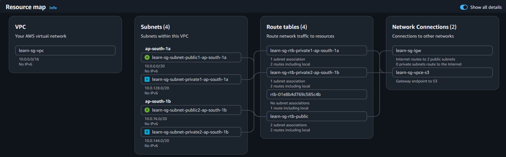
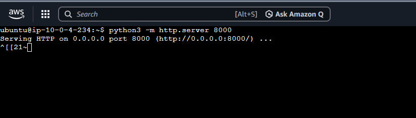
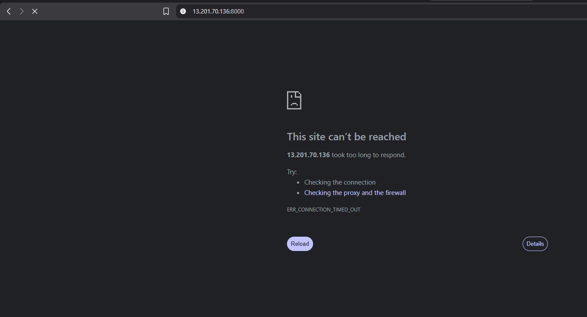
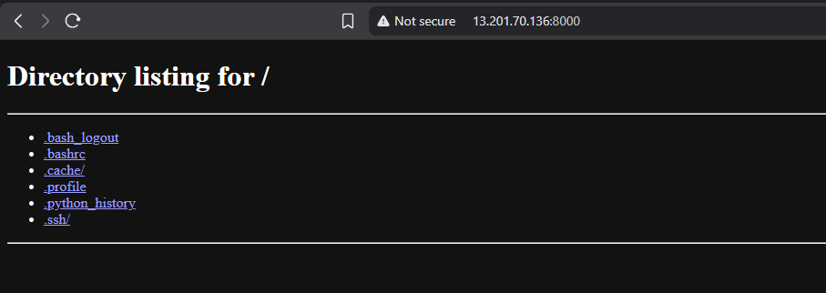
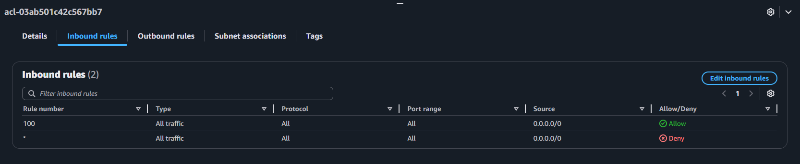
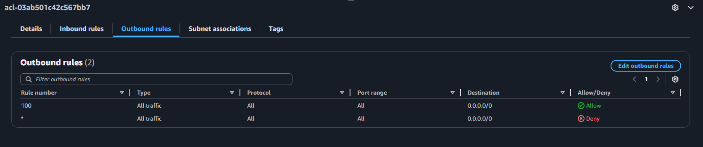

# AWS VPC Security Lab — Security Groups vs Network ACLs

This is a hands-on lab I built to understand something that confused me when I first started with AWS: there isn't just one place where you control who can reach your application. There are two — Security Groups and Network ACLs — and they work differently. I kept reading about them but it didn't click until I actually deployed a server and watched traffic get allowed and blocked at each layer. This repo is my write-up of that experiment.

**Region:** Asia Pacific (Mumbai), `ap-south-1`
**What I used:** Amazon VPC, Amazon EC2, Security Groups, Network ACLs

---

## What I was trying to prove

In AWS, a request from a user has to pass through two separate gates before it reaches your application:

- A **Security Group**, which sits on the individual EC2 instance.
- A **Network ACL (NACL)**, which sits on the whole subnet.

The thing I wanted to see for myself is that traffic has to be allowed at *both* of these. If either one blocks it, the request never arrives. It's an AND, not an OR. The easiest way to test that was to run a tiny web server and then keep flipping rules on and off to watch what happened in the browser.

Here's the difference between the two layers, which I'll come back to throughout:

| | Security Group | Network ACL |
|---|---|---|
| Where it applies | One EC2 instance | An entire subnet |
| Can it allow? | Yes | Yes |
| Can it deny? | No (allow only) | Yes |
| Does it remember connections? | Yes (stateful) | No (stateless) |
| How rules are read | All together | In number order, lowest first |

---

## How the traffic flows

When I open the app in my browser, the request travels through the VPC like this. The last two stops are the ones this lab is about:

```
Me (browser)
   |
   v
Internet Gateway        (learn-sg-igw)
   |
   v
Public Route Table      (learn-sg-rtb-public)
   |
   v
Public Subnet
   |
   v
NACL                    <- subnet-level gate (stateless, can allow and deny)
   |
   v
Security Group          <- instance-level gate (stateful, allow only)
   |
   v
EC2 Instance -> python3 -m http.server 8000
```

I started by creating a custom VPC with the "VPC and more" wizard, which set up the subnets, route tables, internet gateway and a default NACL for me across two Availability Zones. Here's the resource map it produced:



That's one VPC, four subnets (two public, two private) spread across `ap-south-1a` and `ap-south-1b`, four route tables, an internet gateway, and an S3 gateway endpoint.

---

## Setting it up

1. Created the custom VPC (`learn-sg-vpc`, CIDR `10.0.0.0/16`) using the VPC and more wizard.
2. Launched an EC2 instance (Ubuntu, t2.micro) into one of the public subnets, with a public IP turned on.
3. SSH'd in and updated the package list:
   ```bash
   sudo apt update
   ```
4. Started a basic web server. Ubuntu already ships with Python 3, and Python has a web server built into its standard library, so I didn't have to write any code — this one command runs a server that lists the current folder:
   ```bash
   python3 -m http.server 8000
   ```



With the server running, anything reaching port 8000 on the instance should get a directory listing back. Now I could start testing the two security layers.

---

## The experiments

For each one I changed a single rule and then loaded `http://<public-ip>:8000` to see what happened.

### 1. Default state — only port 22 is open

Out of the box, the Security Group only allowed port 22 (SSH), which is what lets me connect in the first place. Port 8000 wasn't allowed, so I expected the page not to load.



It timed out — `ERR_CONNECTION_TIMED_OUT`. The Security Group quietly dropped the request because nothing told it to allow port 8000. This is AWS's default-deny behaviour, and it's working as intended.

### 2. Allow port 8000 in the Security Group

I added an inbound rule to the Security Group: Custom TCP, port 8000, source `0.0.0.0/0`. I left the NACL alone (still at its default allow-all).



This time the directory listing loaded straight away. Both layers were now letting port 8000 through, so the request made it all the way to the server.

### 3. Deny port 8000 at the NACL

This is the experiment I really wanted to run. I left the Security Group allowing port 8000, but went to the NACL and added an inbound rule to *deny* port 8000, giving it a lower rule number than the allow-all rule:

```
Rule 100  DENY   Custom TCP   port 8000   source 0.0.0.0/0
Rule 200  ALLOW  All traffic              source 0.0.0.0/0
```

NACLs read their rules in number order, lowest first, and stop at the first one that matches. So rule 100 caught the port 8000 request and denied it before rule 200 was ever looked at.

The page stopped loading — even though the Security Group was still allowing it. That was the moment it clicked for me: the NACL is the outer gate, and an instance owner allowing traffic on their Security Group can't override a deny set at the subnet level.

### 4. Showing that rule order is what matters

To double-check my understanding, I flipped the order — allow-all first, deny second:

```
Rule 100  ALLOW  All traffic              -> matches first, so traffic is ALLOWED
Rule 200  DENY   Custom TCP   port 8000   -> never gets evaluated
```

The page loaded again. Same two rules as before, opposite result, and the only thing I changed was which rule had the lower number. That confirmed it's not about which rule is "stricter" — it's purely first-match-wins by rule number.

For reference, here are the default NACL inbound and outbound rules I was working from:




---

## Results at a glance

| Experiment | Security Group | NACL | What happened |
|---|---|---|---|
| 1 | only port 22 | allow all | Blocked (timed out) |
| 2 | port 8000 allowed | allow all | Loaded (200) |
| 3 | port 8000 allowed | deny 8000 at rule 100 | Blocked by the NACL |
| 4 | port 8000 allowed | allow at 100, deny at 200 | Loaded — order decided it |

---

## What I took away from this

- Traffic has to be allowed at both layers. A block at either one wins, so it behaves like an AND, not an OR.
- Security Groups can only allow, never deny. That sounds limiting until you realise the NACL is there to handle denies — like blocking a specific bad IP, which a Security Group genuinely cannot do.
- NACLs read rules lowest-number-first and stop at the first match, so the order you number them in changes the outcome.
- Security Groups are stateful, meaning if a request is allowed in, its reply is allowed back out automatically. NACLs are stateless, so the return traffic needs its own rule (and it leaves on a random high port, which is easy to forget).
- The reason for having both is defense in depth — if someone misconfigures one layer, the other still stands. The design makes sure a mistake can only make things more locked down, not accidentally wide open.

While I was doing this I ran into a few specific questions and confusions. Rather than gloss over them I wrote them up properly, since working through them is most of what I actually learned:

- [Security Group vs NACL, and whether you even need a NACL](docs/01-security-group-vs-nacl.md)
- [Stateful vs stateless, and why a Security Group's source field still can't block an IP](docs/02-stateful-vs-stateless.md)
- [How NACL rule ordering works when two rules seem to apply](docs/03-nacl-rule-ordering.md)
- [CIDR notation, /32, and the source-field error I hit](docs/04-cidr-and-source-field.md)

---

## Cleaning up

Everything here fits in the Free Tier, but I tore it down anyway out of habit:

1. Terminated the EC2 instance.
2. Deleted the custom VPC, which takes its subnets, route tables, internet gateway and NACL with it.

---

## What's in this repo

```
aws-vpc-security-lab/
├── README.md
├── docs/
│   ├── 01-security-group-vs-nacl.md
│   ├── 02-stateful-vs-stateless.md
│   ├── 03-nacl-rule-ordering.md
│   └── 04-cidr-and-source-field.md
├── screenshots/
│   ├── 01-vpc-resource-map.png
│   ├── 02-python-server.png
│   ├── 03-blocked-port22-only.png
│   ├── 04-success-directory-listing.png
│   ├── 05-nacl-inbound.png
│   └── 06-nacl-outbound.png
└── .gitignore
```
